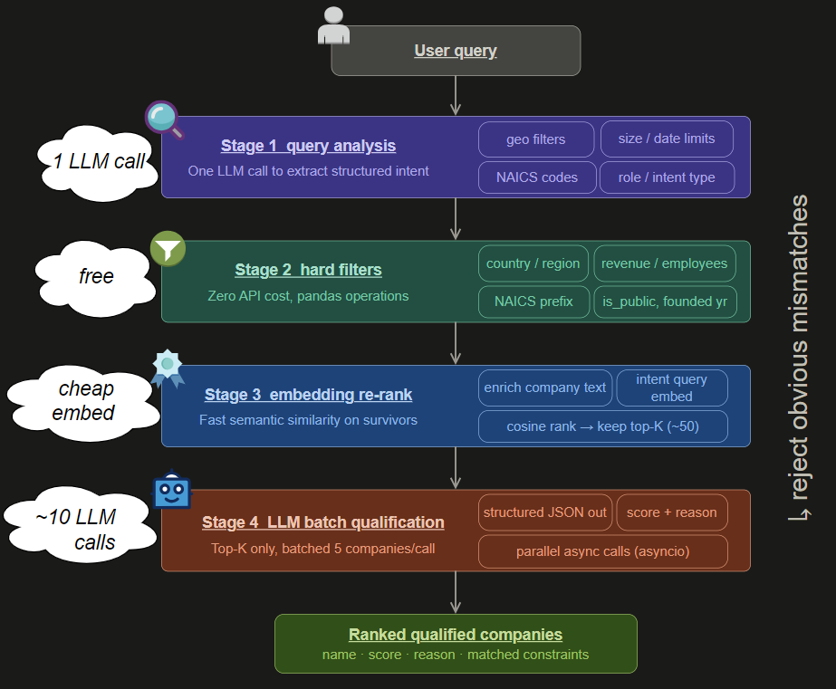

# Intent Qualification System

## Approach

The system is designed as a simple idea done carefully:

> [!IMPORTANT]  
> filter first $\rightarrow$ reason later

Instead of sending everything to an LLM, we progressively narrow the candidate set and only apply expensive reasoning where it is needed.

### Flow



1. **Query understanding**  
   One LLM call extracts structured intent: industry, geography, constraints, and role.  
   This makes the query explicit and reduces ambiguity.

   Helps separate:
   - operators vs software  
   - brands vs suppliers  

2. **Hard filtering**  
   Fast deterministic filters remove obvious mismatches (geo, NAICS, size).  
   Missing data $\rightarrow$ not a hard reject (keeps recall high).

3. **Semantic ranking**  
   Companies $\rightarrow$ rich text $\rightarrow$ embedding ranking.  
   Uses a cleaned query (e.g. *“packaging supplier cosmetics”*) to bias toward the correct role.  

   Embeddings $\rightarrow$ shortlist candidates, not final decisions.

4. **Final qualification**  
   Top-$K$ only $\rightarrow$ LLM scoring:
   - score $(0\text{–}10)$  
   - matched  
   - reason  

   Applies strict reasoning on:
   - role (supplier vs operator)  
   - geography  
   - actual evidence in data  

---

## Tradeoffs

- **Cost**: LLM sees only top-$K$  
- **Speed**: filtering is instant, calls run in parallel  
- **Accuracy**: LLM used only for reasoning-heavy decisions  
- **Missing Data**: missing data $\rightarrow$ tolerated  

Key choices:
- filtering = **recall-first** (avoid early false negatives)  
- embeddings = **ranking only** (similarity $\neq$ relevance)  
- small batches $\rightarrow$ better per-company reasoning  

> [!TIP]  
> The pipeline trades a bit of early precision for stronger final accuracy.

---

## Error Analysis

- **Supplier vs operator confusion**  
  related companies $\rightarrow$ embedding may rank the wrong side of the supply chain  

- **Geography noise**  
  imperfect or inconsistent location data $\rightarrow$ weaker filtering  

- **Vague queries**  
  “fast-growing” $\rightarrow$ not encoded in structured fields  

- **Implicit relationships**  
  upstream roles $\rightarrow$ not explicitly mentioned in descriptions  

> [!NOTE]  
> Most errors come from missing or ambiguous data rather than pipeline logic.

---

## Failure Modes

- **Weak descriptions $\rightarrow$ weak evidence**  
  generic text $\rightarrow$ unreliable scoring  

- **Missing data $\rightarrow$ noisy retrieval**  
  fewer constraints $\rightarrow$ lower candidate quality  

- **Top-$K$ too small $\rightarrow$ missed matches**  
  ranking errors $\rightarrow$ true positives never evaluated  

- **Prompt injection $\rightarrow$ unsafe reasoning**  
  free text $\rightarrow$ may contain misleading signals  

> [!WARNING]  
> Always validate LLM outputs and avoid trusting raw text blindly.

---

## Schema Rule

Necessary foramt that it must be followed when different query rules are applied:

```javascript
{
  "geo_country": string | null,
  "geo_countries": [string],
  "geo_region": string | null,
  "industry_keywords": [string],
  "naics_prefixes": [string],
  "min_employees": int | null,
  "max_employees": int | null,
  "min_revenue": float | null,
  "max_revenue": float | null,
  "founded_after": int | null,
  "founded_before": int | null,
  "is_public": bool | null,
  "business_models": [string],
  "role_intent": string,
  "semantic_query": string,
  "complexity": string
}
```
